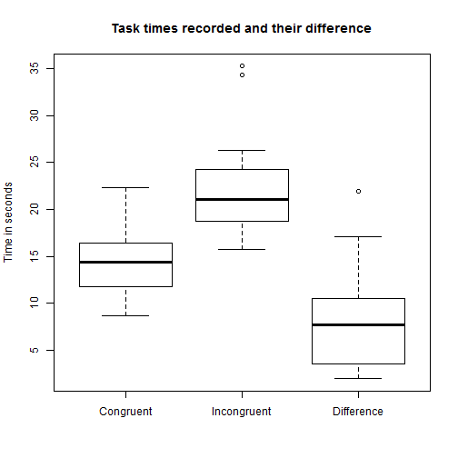
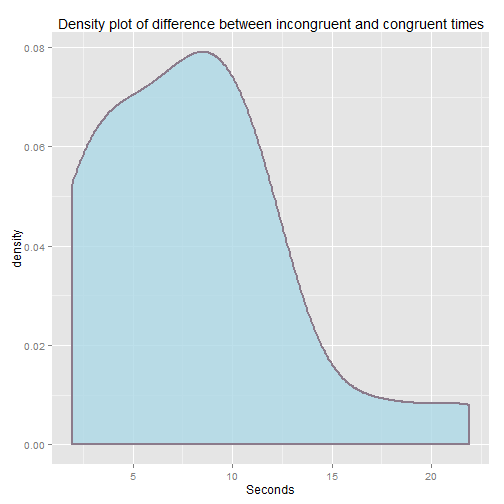

P1 - Statistics: The Science of Decisions
========================================================
#### *Louis Pienaar*
#### *2015/08/04*


### Question 1: Variables 

* The independent variable in this experiment was whether the word name and font color were the same (congruent) or different (incongruent)
* The dependent variable is the time it takes to name the ink colors

### Question 2: Hypothesis

The stroop effect theorem implies that when comparing congruent vs incongruent time, that the incongruent time is more than the congruent time. From the problem statement and the answers given in question three and four, it is clear that there could be strong evidence to support this statement. 
* The most reasonable null hypothesis would be that having the ink color and word be different (incongruent) have no effect on the time it takes to name the ink colors. 
* The most reasonable alternative hypothesis would be that by having the ink color and word be different (incongruent) would result in an increased in the time it takes to name the ink colors (compared to the time when the ink color and word does not differ)

$H_0: \mu_d \leq 0$  
$H_A: \mu_d > 0$ 

To test this hypothesis we should use a one-tailed dependent *t*-test for paired samples:

$t = \frac{\overline{X}_D}{s_D/\sqrt{n}}$

Where $\overline{X}_D$ is the calculated difference between the incongruent and congruent results for each respondent and $s_D$ is the standard deviation of these differences.

### Question 3: Descriptive Statistics

Average of reading times:

```
##   Congruent Incongruent  Difference 
##   14.051125   22.015917    7.964792
```
Standard deviation of reading times:

```
##   Congruent Incongruent  Difference 
##    3.559358    4.797057    4.864827
```
Standard error of mean reading times:

```
##   Congruent Incongruent  Difference 
##   19.339492   22.483686    8.020707
```


### Question 4: Visualizations

 


From the box plots it is clear that it is highly likely that that the incongruent times are more than the congruent times. It should also be noted that not even the outliers on the differences are below zero.

 

The density plot of the differences show that the distribution is not quite normal but close enough to still justify the use of a *t*-test. (The paired t-test assumes that the differences between pairs are normally distributed).

### Question 5: Statistical Test
To test this hypothesis we should use a one-tailed dependent *t*-test for paired samples to see if the differences between the incongruent time is more than that of the congruent time. We can use the conventional &alpha; value of $0.05$. Since the sample size $24$, the Degrees of Freedom is $23$ (n-1). The critical value of the t-statistic $1.714$. 

$t = \frac{\overline{X}_D}{s_D/\sqrt{n}}$

Where $\overline{X}_D$ is the calculated difference between the incongruent and congruent results for each respondent and $s_D$ is the standard deviation of these differences.  </br>

Calculating the t-statistic: $t = \frac{7.964792 - 0}{4.864827/\sqrt{24}} = 8.021$ </br>
Since $8.021$ is larger than $1.714$, we can reject the null hypothesis in favor of the alternative. </br>

Therefore there is significant evidence that supports the theory that by changing the word and the ink color to be different, you increase the time it takes a person to complete the task of reading the ink color. It is as expected, as the stroop effect is well documented. But if you were to be the first person to run this experiment you might not have expected this result :)

### Question 6: Research and other info

The words themselves have a strong influence over your ability to say the color. The interference between the different information (what the words say and the color of the words) your brain receives causes a problem. There are two theories that may explain the Stroop effect:

* Speed of Processing Theory: the interference occurs because words are read faster than colors are named.
* Selective Attention Theory: the interference occurs because naming colors requires more attention than reading words.


Neuroscience For Kids. (n.d.). Retrieved August 4, 2015, from https://faculty.washington.edu/chudler/words.html#seffect

